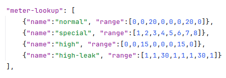
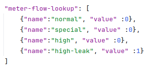
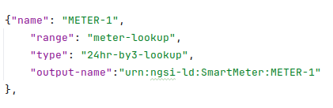
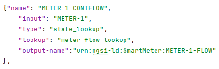
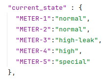
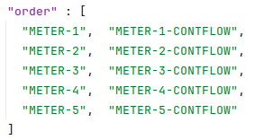
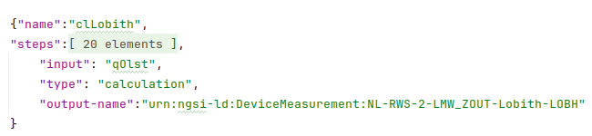

# waterverse-sdg-component

## Table of Contents
- [Overview](#overview)
- [Functionality](#functionality)
 - [Synthetic Data Generation Package](#SDG-Package)
 - [WDME SDG Component](#WDME-SDG-Component)
- [Installation](#installation)
- [Configuration](#Configuration)
- [Limitations](#limitations)
- [Acknowledgments](#acknowledgments)

## Overview
This is the synthetic data generation (SDG) component project for WATERVERSE. It comprises a re-usable Python package to generate synthetic data and a WDME synthetic data generation component to provide a web-based interface to access the Python package.

The overall concept and operation of the SDG component is explained in this paper: [https://dx.doi.org/10.15131/SHEF.DATA.29921129.V1](https://dx.doi.org/10.15131/SHEF.DATA.29921129.V1)

## Functionality

### SDG Package
The SDG package project is a python package that contains the functionality for defining and generating synthetic data and an associated setup.py for package building, using python setup.py bdist_wheel. 

The waterverse_sdg/sdg.py file contains the functionality for managing the SDG data lifecycle, through the creation, retrieval, updating and deletion of synthetic sensors.
Each sensor group is defined through the json files in the waterverse_sdg/data folder.

The testbed.py files contains a test harness showing the data lifecycle for each pilot, typically:

In this example, the pilot 'pwn-1' is added to the SDG model and a sensor definition is added through the add_sensor_to_pilot method, using the sensor definition defined in the waterverse_sdg/data/pwn_1.json definition. This definition defines 2 sensors where one sensor uses the results of the first sensor to determine a final value.

### WDME SDG Component
The WDME SDG Component is a wrapper project that exposes the SDG package to WATERVERSE'S WDME using fastapi (https://fastapi.tiangolo.com/).

The api provides an openAPI interface through /docs which details all available calls and expected payloads.

The general approach for working with the SDG WDME component mirrors the operation SDG package testbed, in that initially a sensor bundle is created using add_sensor_to_pilot, taking a pilot name, sensor name and json payload (as defined in waterverse_sdg/data). On success, this will return 200. 

Synthetic data for the sensor can then be created using the get_data request which will return the number of time steps required.

For pilot definitions with states, the put_pilot_state request can be used to update state.

## Installation
Both components have been developed using pipenv (https://pipenv.pypa.io/en/latest/) and are designed for Python 3.13+.

## Configuration
Synthetic data definitions are created as json data and passed into the SDG using either the add_sensor_to_pilot method or api endpoint, depending on whether the user is working with the python code ( SDG package) or WMDE component.

In both cases, the current set of SDG definitions are maintained as a dictionary in sdg.py as pilot_model (line 51). Adding a new sensor requires that the sensor name is unique, with the json data having the form of:

    {
	    //required
        attributes: []      //list of attribute definitions
        step: int           //seconds between updates
        current_state : {}  //current state of properties

        //optional
        order: []           //order that properties are processed
        reference_data: {}  //look up of labels to reference data 
    }

The attribute definitions tend to be pilot / sensor-specific and are open to extension through the process_attrib method in sdg.py, line 283. Each attribute is required to have a type which is used to determine how it’s processed.

In general, each different type of property will require some data and processing for its type. Data is defined in the json file and processing is defined in the sdg.py file. This approach is taken so that the data, which generally requires a lot of modification can be quickly updated, but the updating the processing is generally a less frequent activity.

The Cyprus pilot (cy_payload.json) is a useful example. The pilot required the definition of a set of smart water meters that would generate 15 minute consumption data and continuous flow alarms. The users of the synthetic data wanted to be able to define different usage patterns for high, low, and normal consumption as well as a leakage pattern that would trigger the continuous flow alarm.

To create the synthetic data model, a json definition file was created that defined consumption and continuous flow as a set of attributes. Whilst each meter could have been defined as a separate sensor, and associated json file, defining them as a single group reduced the definition complexity / duplication and allowed multiple sensor values to be generated in a single ‘get_data’ call.

To generate the flow values for each sensor, a table of data was generated that mapped usage patterns to flow amounts, using an 8 value over 24 look-up, such that when updated, datetime would be translated to one of 8 values:

Likewise, a continuous flow table was produced that effectively mapped labels to whether continuous flow occurred:

These tables were then combined into a ‘reference data’ lookup as part of the json file.

Each meter was defined as two attributes; flow and continuous flow.

For the flow attribute, its type was set to ‘24hr-by3-lookup’. This maps to an attribution processing function written into sdg.py and called by the attribute processor. The processing function was written specifically for this use case and uses the range attribute to locate the meter-lookup reference data defined in the json file.

The bespoke processing function maps the current datetime to one of the 8 values given in the range array of the meter lookup to determine current consumption. This is then summed to a running total for the meter.

Likewise, the continuous flow attribute uses a similar definition:

Here, the attribute type is ‘state_lookup’ which will map an attribute state to an appropriate value in the ‘meter-flow-lookup’ dictionary, which will return 0 unless the state is ‘high-leak’.

To define initial states for the attributes, the current_state attribute is populated:

In this instance, meters 3 is set to ‘high-leak’ which will trigger the leak attribute to be set. All other meters have some form of normal operation, so the leak attribute will not be set. During operation, the current state can be changed with the put_pilot_state method.

Finally, in order to ensure that the attributes are processed in the correct order, the ‘order’ attribute is set: 

In this case, the meter and continuous flow attributes are processed in order. Whilst this isn’t crucial for this pilot, it is essential for pilots where attribute values are used to calculate other attributes. For example, in the pwn_1 json file, the ‘clLobith’ attribute is processed based on the value of the ‘qOlst’ sensor:

In the python code, current results are passed into each attribute processing method and historic values are stored across get_data calls, allowing cumulative data to be maintained.

## Limitations
* Both packages (SDG and SDG component) were developed as research proof of concepts and are not intended for operational environments.
* The data definition 'language' used in the SDG is very non-complete and had only been defined in terms that facilitate the creation of the pilot scenarios required for the project. However, the SDG format is suitably open for the development of novel SDG processing.
## Acknowledgments

This project has been funded by the [WATERVERSE project](https://waterverse.eu/) of the European Union’s Horizon Europe programme under Grant Agreement no 101070262.

WATERVERSE is a project that promotes the use of FAIR (Findable, Accessible, Interoperable, and Reusable)
data principles to improve water sector data management and sharing. 

