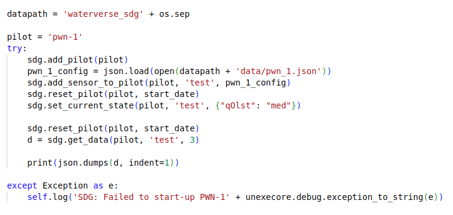
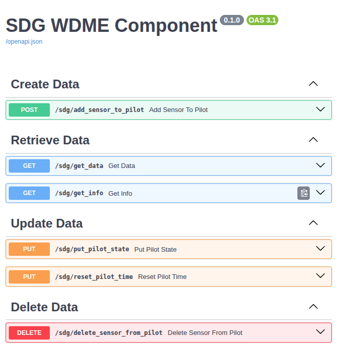

# waterverse-sdg-component

## Table of Contents
- [Overview](#overview)
- [Functionality](#functionality)
 - [Synthetic Data Generation Package](#SDG-Package)
 - [WDME SDG Component](#WDME-SDG-SERVER)
- [Installation](#installation)
- [Limitations](#limitations)
- [Acknowledgments](#acknowledgments)

## Overview
This is the synthetic data generation (SDG) component project for WATERVERSE. It comprises a re-usable Python package to generate synthetic data and a WDME synthetic data generation component to provide a web-based interface to access the Python package.

The overall concept and operation of the SDG component is explained in this paper: [https://dx.doi.org/10.15131/SHEF.DATA.29921129.V1](https://dx.doi.org/10.15131/SHEF.DATA.29921129.V1)

## Functionality

### SDG Package
The SDG package project is a python package that contains the functionality for defining and generating synthetic data and an associated setup.py for package building, using python setup.py bdist_wheel. 

The waterverse_sdg/sdg.py file contains the functionality for managing the SDG data lifecycle, through the creation, retrieval, updating and deletion of synthetic sensors.
Each sensor group is defined through the json files in the waterverse_sdg/data folder.

The testbed.py files contains a test harness showing the data lifecycle for each pilot, typically:

In this example, the pilot 'pwn-1' is added to the SDG model and a sensor definition is added through the add_sensor_to_pilot method, using the sensor definition defined in the waterverse_sdg/data/pwn_1.json definition. This definition defines 2 sensors where one sensor uses the results of the first sensor to determine a final value.

### WDME SDG Component
The WDME SDG Component is a wrapper project that exposes the SDG package to WATERVERSE'S WDME using fastapi (https://fastapi.tiangolo.com/).

The api provides an openAPI interface through /docs which details all available calls and expected payloads.

The general approach for working with the SDG WDME component mirrors the operation SDG package testbed, in that initially a sensor bundle is created using add_sensor_to_pilot, taking a pilot name, sensor name and json payload (as defined in waterverse_sdg/data). On success, this will return 200. 

Synthetic data for the sensor can then be created using the get_data request which will return the number of time steps required.

For pilot definitions with states, the put_pilot_state request can be used to update state.

## Installation
Both components have been developed using pipenv (https://pipenv.pypa.io/en/latest/) and are designed for Python 3.13+.

## Limitations
* Both packages (SDG and SDG component) were developed as research proof of concepts and are not intended for operational environments.
* The data definition 'language' used in the SDG is very non-complete and had only been defined in terms that facilitate the creation of the pilot scenarios required for the project. However, the SDG format is suitably open for the development of novel SDG processing.
## Acknowledgments

This project has been funded by the [WATERVERSE project](https://waterverse.eu/) of the European Union’s Horizon Europe programme under Grant Agreement no 101070262.

WATERVERSE is a project that promotes the use of FAIR (Findable, Accessible, Interoperable, and Reusable)
data principles to improve water sector data management and sharing. 

